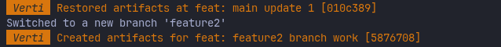

# Verti - Versioned Artifacts

## Usecase

> Artifacts = notes, scratch code, documents etc. that are created as part of coding, research, learning etc.

Often closely tied to the project, I would want them to live in the same repository, except I don't want them to be referred in any manner by git.\
Not even in a `.gitignore`.

This is even more useful now when working with AI agents and is a very simple and flexible solution compared tools that are more sandbox focused and need to be used in a certain specific manner.

What I do want is to have them versioned, so I can go back to a previous version when as ideas evolve or some branches get abandoned, or recreated entirely.

## How it works?

Verti uses githooks - post-commit and reference-transaction to snapshot-or-restore the artifacts as defined via a `verti.toml` config file.\
The snapshots are stored in `~/.verti` directory in a deduplicated manifest-object store manner.\
The files are ignored by git by adding them to `.git/info/exclude` file automatically by verti.

## How to use?

- Clone the repo
- `make build` to build the binary in `./build/verti`
- add it to path
- `verti init`. This opens the repo specific `verti.toml` config file. Can rerun to update the config/hooks as needed.

# Dev notes

### Trying out

A `test-repo` directory can be created with `make test-repo` command. Inside that there's a main branch and a `feature` branch for merge and a `feature2` branch for rebase.
